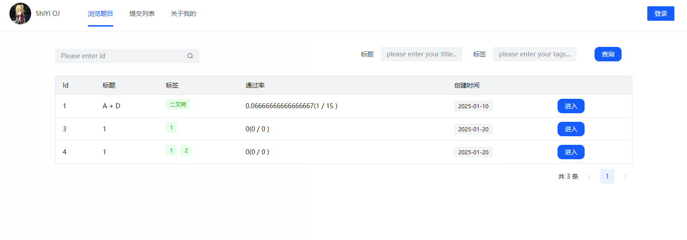
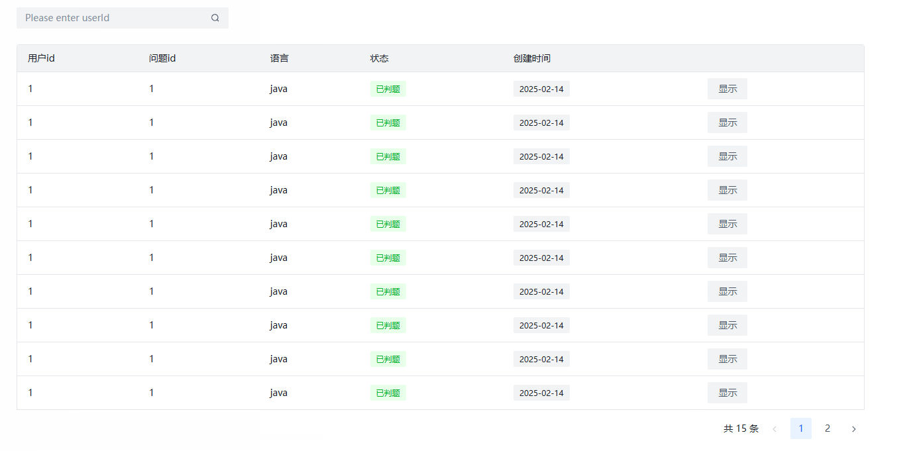
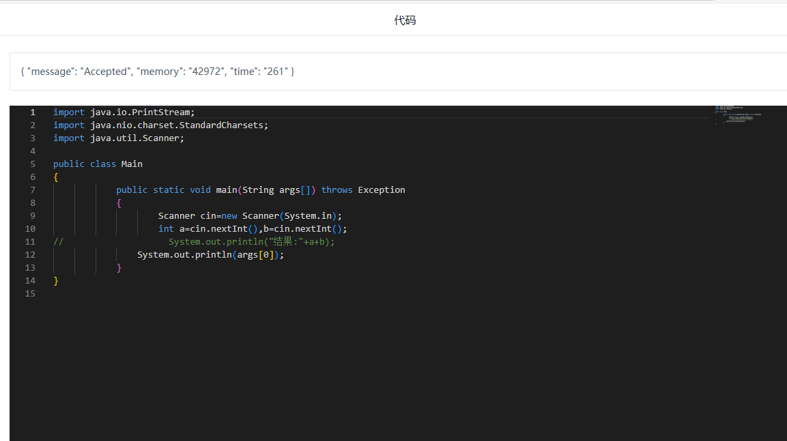
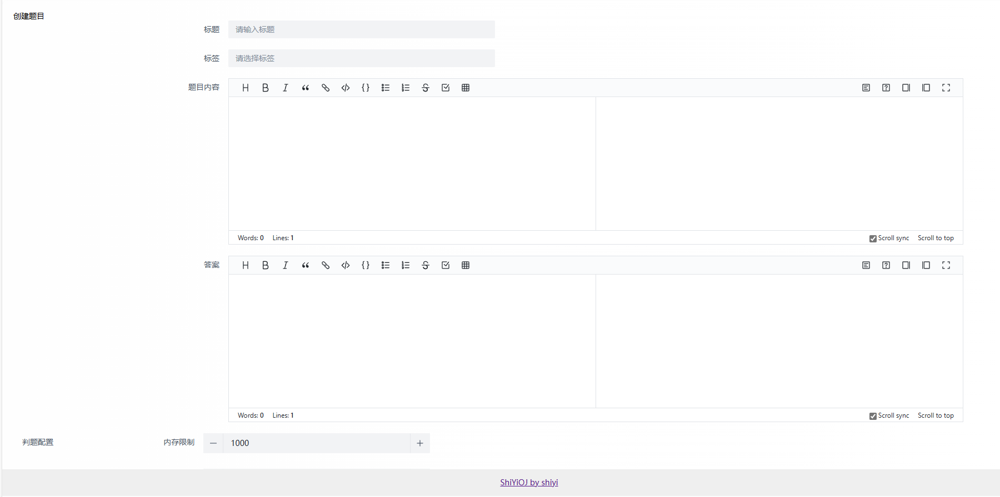
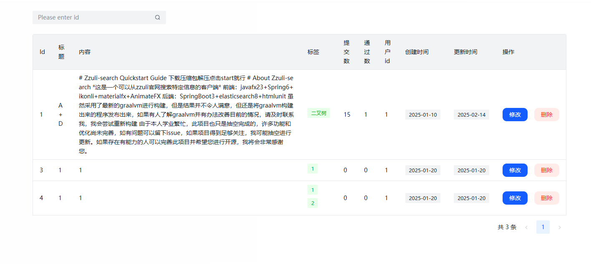
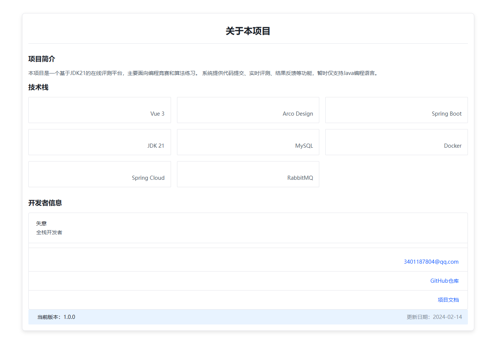

# ShiYiOJ Judge System - Frontend

[](https://vuejs.org/)
[](https://arco.design/vue/docs/start)

基于Vue3构建的在线评测系统前端，包含题目管理、代码提交和评测结果展示功能。

## ✨ 功能特性

- **用户系统**
    - 用户登录/注册
    - 登录状态持久化

- **题目管理**
    - 题目创建/编辑/删除
    - 题目列表展示
    - 题目详情查看

- **评测功能**
    - Monaco Editor代码编辑器（VSCode同款）
    - 代码提交与评测
    - 提交记录查询
    - 评测结果详情展示

- **内容管理**
    - ByteMD Markdown编辑器
    - 题目描述的Markdown渲染展示

## 🛠 技术栈

- **框架**: Vue3 + Vue Router + Vuex
- **UI组件库**: Arco Design Vue
- **代码编辑器**: Monaco Editor
- **Markdown**: ByteMD（编辑+展示）
- **构建工具**: Vue CLI
- **包管理**: yarn/npm

## 🚀 快速开始

### 环境要求
- Node.js >= 18.20.4
- yarn/npm

### 安装依赖
```bash
yarn install
# 或
npm install
```
### 相关项目
- [ShiYiOJ Judge System - Backend](https://github.com/2743305544/shiyioj-backend)
- [JavaCodeSandbox](https://github.com/2743305544/JavaCodeSandbox)

### 相关项目截图







